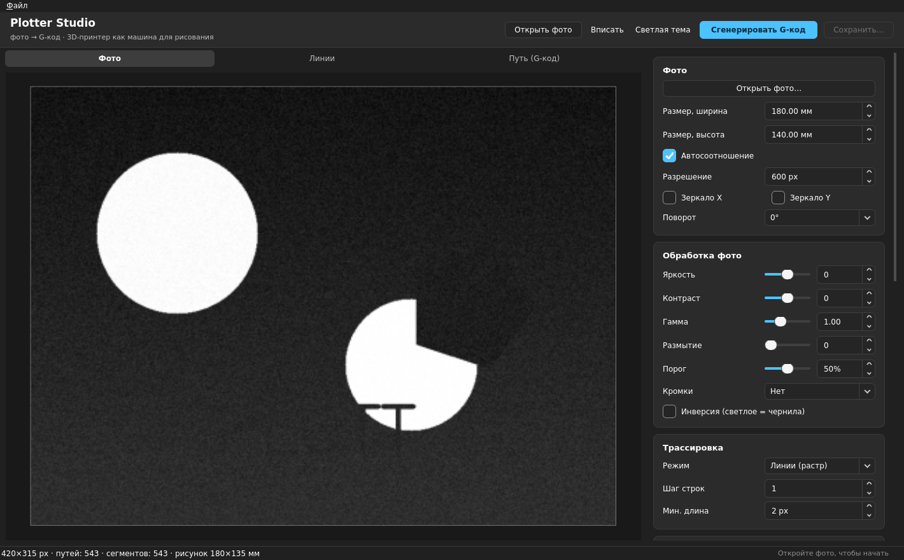
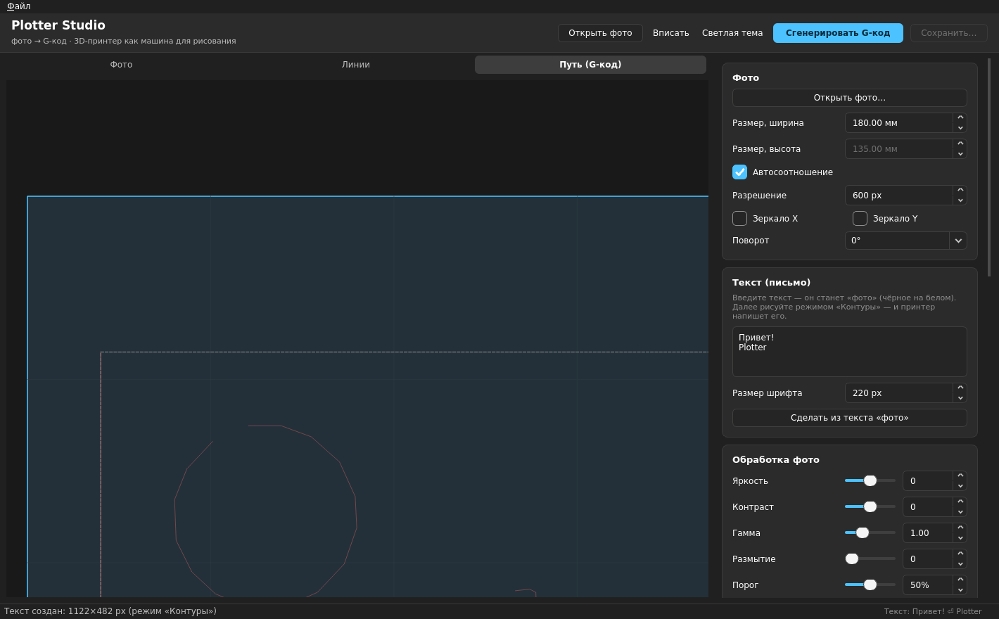
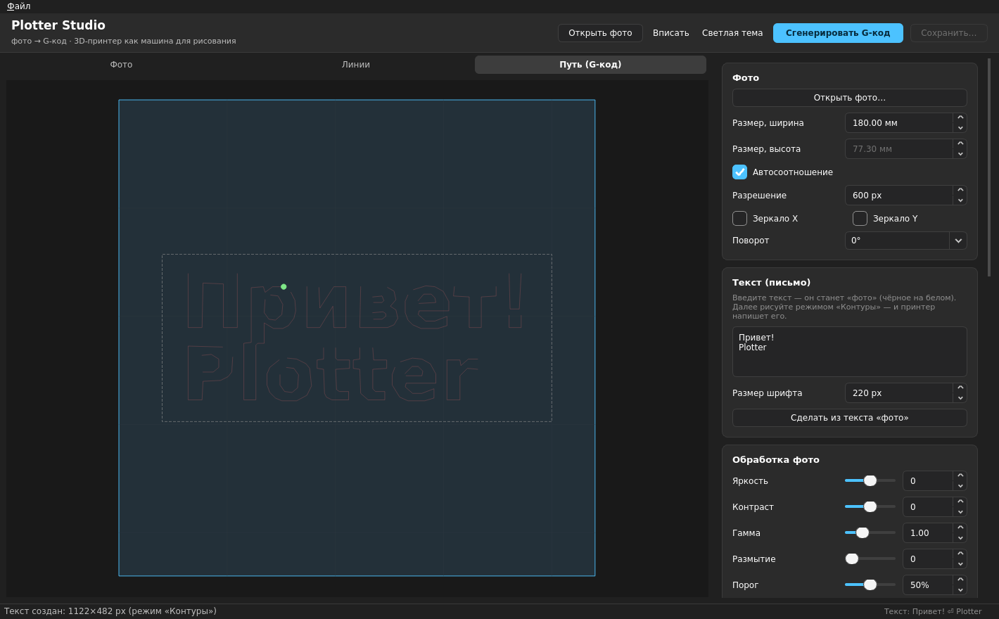
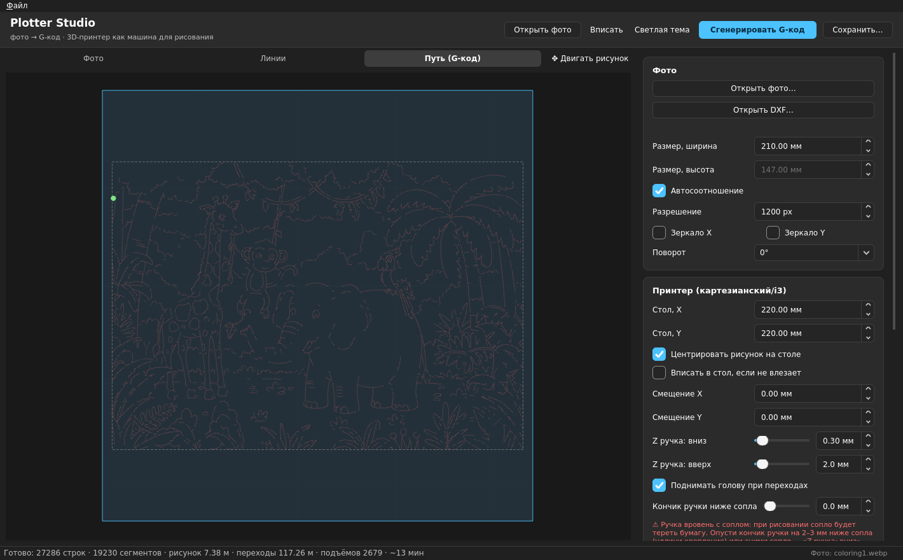
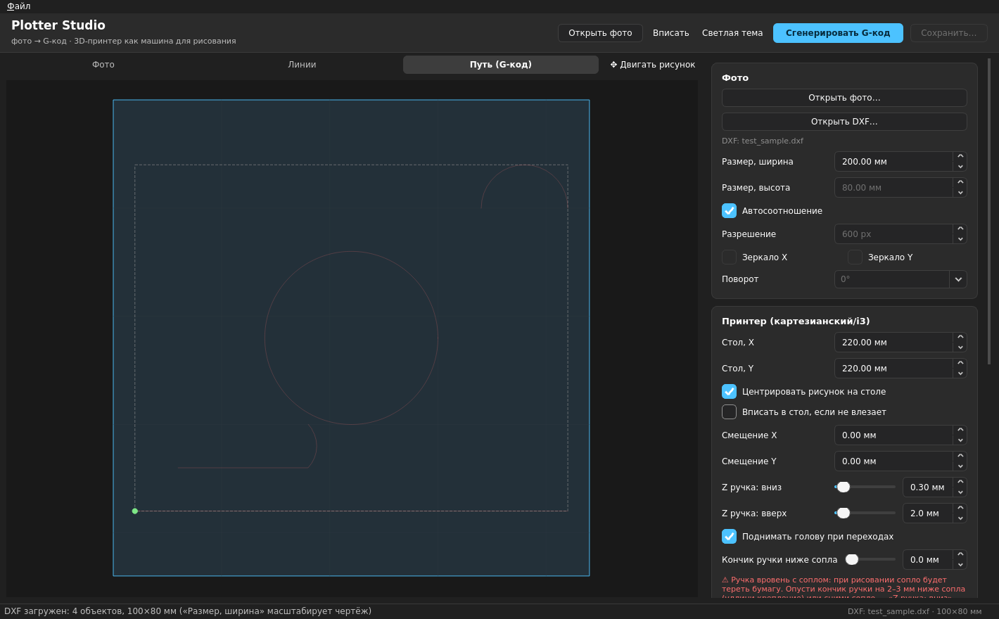

# Plotter Studio — фото в G-код для 3D-принтера


Программа превращает **3D-принтер (картезианский/i3) в машину для черчения, письма и рисования**:
открываете фото (или текст), настраиваете обработку и параметры — и получаете **G-код**,
по которому принтер-«ручка» рисует изображение на столе, **поднимая голову** при переходах
в другую часть рисунка.

Концепция и алгоритмы обработки/трассировки — порт проекта
[MagicGyver](https://alexgyver.github.io/MagicGyver/) (AlexGyver, MIT) с адаптацией
под G-код 3D-принтера.

> ⚠️ **Проект в бета-разработке.** Возможны баги и изменения интерфейса/параметров
> между версиями. Сейчас запуск только из исходников (`python main.py`) — в будущем
> планируются готовые **сборки `.exe`** для Windows, без установки Python.

<p align="center">
  
  
  
</p>
<p align="center">
  
  
</p>

## Содержание

- [Возможности](#возможности)
- [Установка](#установка)
  - [Windows 10/11](#windows-1011-основная-платформа)
  - [Linux / macOS](#linux--macos)
  - [Частые проблемы установки](#частые-проблемы-установки)
- [Быстрый старт](#быстрый-старт)
- [Рецепт: печатный текст и почерк](#рецепт-печатный-текст-и-почерк-ровные-замкнутые-буквы)
- [Как прикрутить ручку к принтеру](#как-прикрутить-ручку-к-принтеру)
- [Структура G-кода](#структура-g-кода)
- [Параметры (справка)](#параметры-справка)
- [Структура проекта](#структура-проекта)
- [Тесты](#тесты)
- [Если фото не открывается](#если-фото-не-открывается)
- [Ограничения / что можно добавить](#ограничения--что-можно-добавить)
- [Лицензия](#лицензия)
- [Благодарности](#благодарности)

## Возможности

- **Обработка фото** (как в MagicGyver): яркость, контраст, гамма, размытие, порог,
  кромки (Median / Sobel), инверсия, поворот, зеркало.
- **6 режимов трассировки**:

  | Режим | Что делает | Когда брать |
  |---|---|---|
  | **Линии (растр)** | Тёмные пиксели рисуются построчными линиями (горизонталь или вертикаль) | Фотографии, тонировка, детализация |
  | **Контуры (все)** | Все контуры, включая внутренние дырки | Логотипы с деталями, схемы |
  | **1 линия (внешний контур)** | Только внешние силуэты, каждый обходится один раз, дырки не рисуются | Чистый обвод, почерк, минимум линий |
  | **Линии раскраски (вектор)** | Тонкое сужение (thinning) линий до центральной 1-px «оси», обрезка заусенцев, сшивка разрывов и упрощение Дугласа — Пекера — на выходе чистые векторные полилинии | Раскраски, чертежи от руки, схемы: каждая линия рисуется один раз, как в векторе |
  | **Ползание (crawl)** | Один непрерывный путь «по тёмным пикселям» — прямой порт алгоритма MagicGyver | Равномерное штрихование, минимум подъёмов ручки |
  | **Волны (waves)** | Непрерывные волны, амплитуда следует за тёмнотой фото (тёмное — плотные волны, светлое — почти прямая линия) | Рисунки «волнами», декор |

- **Загрузка DXF**: кнопка «Открыть DXF…» (или Файл → Открыть DXF…, Ctrl+Shift+D).
  Поддерживаются LINE, LWPOLYLINE/POLYLINE (с дугами bulge), CIRCLE, ARC, SPLINE,
  ELLIPSE в modelspace. Единицы берутся из `$INSUNITS` (без полей — считаем мм).
  Обработка и трассировка не применяются: вектор идёт в G-код как есть,
  «Размер, ширина» масштабирует чертёж, рисунок двигается мышью по столу.
  Текст (TEXT/MTEXT) и вставки (INSERT) в DXF игнорируются.
- **Доводка маски** (важно для печатного текста и тонких линий):
  - **Сшивка разрывов** (0–7 px, по умолчанию выкл) — морфологическое замыкание
    заделывает «трещины» в тонких линиях, из-за которых буквы рвутся на куски;
  - **Утолщение линии** (0–5 px) — dilation «чернил», если шрифт тоньше 1–2 px.
- **Замкнутые контуры**: контурные режимы рисуют полигон целиком, включая
  последнюю грань (в ранних версиях у каждой буквы «отваливался» хвостик).
- **Точный контур** (субпиксельный, включён по умолчанию): в режимах «Контуры»
  и «1 линия» граница ищется по серому изображению (marching squares) — линия
  идёт по реальному антиалиасированному краю картинки, а не по «лесенке»
  пикселей бинарной маски. Точность: на эталонном круге отклонение 0.007 px
  против 1.0 px у классического `findContours` (примерно в 100 раз точнее).
  Скорость: изображение 1200 px обрабатывается за десятки миллисекунд.
  Чекбокс «Точный контур» — отключить, чтобы вернуться к классике (и как
  фолбэк: при любой ошибке точный метод сам отступает на `findContours`).
- **Сглаживание линии** (метод Чайкина, 0–24 итерации) — превращает лесенку
  пикселей в плавную кривую. Для **своего почерка** (фото рукописных строк):
  режим «1 линия»/«Контуры» + сглаживание 2–4, можно докручивать «на глаз»
  до 24 (число точек ограничено, файлы не «взрываются»).
- **Режим письма**: вводите текст → из него делается «фото» → контуры → принтер пишет буквы.
- **G-код для ручки**:
  - размер стола, центрирование, смещение X/Y;
  - Z «ручка вниз» / Z «ручка вверх» (настройка подъёма);
  - **автоподъём головы при переходах** (или чистый XY-перелёт, если выключить);
  - скорости рисунка / перехода / Z;
  - **стартовый и финальный G-код** — редактируемые текстом под вашу прошивку;
  - несколько проходов для более тёмных линий (со смещением).
- **Живое превью**: 3 вкладки — Фото (обработанное), Линии (маска + трассировка), Путь
  (G-код на столе со сеткой 50 мм и стартовой точкой). Зум колесом, панорама мышью.
- **Перемещение рисунка мышью**: кнопка «✥ Двигать рисунок» → тяните рисунок по столу
  во вкладке «Путь», смещения X/Y обновляются на лету (отцентровать/сдвинуть).
- **Вписать в стол**: если рисунок больше стола — автоматическое уменьшение
  пропорционально (без обрезки).
- **Сохранение настроек**: все параметры, тема и последнее фото сохраняются
  автоматически и восстанавливаются при следующем запуске (QSettings).
- **Оценка результата**: длина линий, число переходов и подъёмов, время печати.
- **Тёмная и светлая темы** в стиле Windows 11 (Fluent).

## Установка

### Windows 10/11 (основная платформа)

1. **Установите Python 3.10 или новее** — [python.org/downloads](https://www.python.org/downloads/).
   При установке обязательно поставьте галочку **«Add python.exe to PATH»**.
   Проверить, что всё встало:
   ```bat
   python --version
   ```
2. **Скачайте проект** — либо `git clone`, либо кнопка «Code → Download ZIP» на
   странице репозитория и распаковка архива.
   ```bat
   git clone https://github.com/Bit-wizard-esp/plotter-studio.git
   cd plotter-studio
   ```
3. *(рекомендуется)* **Создайте виртуальное окружение**, чтобы зависимости
   проекта не мешались с остальным Python на компьютере:
   ```bat
   python -m venv venv
   venv\Scripts\activate
   ```
   После активации в начале строки консоли появится `(venv)`.
4. **Установите зависимости**:
   ```bat
   pip install -r requirements.txt
   ```
   Всё ставится готовыми колёсами (wheels) — компилятор/MSVC не нужен.
5. **Запустите программу**:
   ```bat
   python main.py
   ```
   Откроется окно Plotter Studio в тёмной теме.

В следующий раз для запуска достаточно снова активировать окружение и
выполнить `python main.py`:
```bat
cd plotter-studio
venv\Scripts\activate
python main.py
```

### Linux / macOS

Официально не тестировалось (проект писался и проверялся под Windows,
подсказки про клиренс и т. п. рассчитаны на Windows-путь установки), но
PySide6/OpenCV/Pillow кроссплатформенные, и в большинстве случаев программа
запустится так же:

```bash
git clone https://github.com/Bit-wizard-esp/plotter-studio.git
cd plotter-studio
python3 -m venv venv
source venv/bin/activate
pip install -r requirements.txt
python3 main.py
```

Если на Linux не хватает системных Qt-библиотек для PySide6, обычно помогает:
```bash
sudo apt install libgl1 libegl1 libxkbcommon0
```

### Частые проблемы установки

| Проблема | Решение |
|---|---|
| `python` не найден / `'python' is not recognized` | Python не в PATH — переустановите с галочкой «Add to PATH» или используйте `py` вместо `python` |
| `pip install` падает на PySide6/OpenCV | Обновите pip: `python -m pip install --upgrade pip`, затем повторите установку зависимостей |
| Окно открывается, но всё серое / шрифты кривые | Обновите видеодрайверы; как временный вариант — переключите тему на светлую в настройках |
| `ModuleNotFoundError: No module named 'plotter'` | Запускайте `python main.py` именно из корня `plotter-studio/`, а не из другой папки |
| AVIF-фото не открывается | `pip install pillow-avif-plugin` (см. раздел [Если фото не открывается](#если-фото-не-открывается)) |

## Быстрый старт

1. **Открыть фото** (или вписать текст в карточку «Текст (письмо)» → «Сделать из текста»).
2. В карточке **Фото**: размер рисунка на столе (мм), разрешение (px), поворот/зеркало.
3. В **Обработке фото** подберите порог так, чтобы во вкладке «Линии» осталась только
   нужная «тень» изображения (тёмное = чернила; светлое — при инверсии).
4. В **Трассировке** выберите режим (для фото — «Линии», для логотипов/текста — «Контуры»).
5. В **Принтере** укажите размер стола, Z ручки, скорости; при желании поправьте
   стартовый/финальный G-код.
6. **Сгенерировать G-код** → во вкладке «Путь (G-код)» виден весь маршрут → **Сохранить…**
7. G-код загружайте в ваш слайсер/прошивку (OctoPrint, Mainsail, Pronterface,
   SD-карта — любой способ, который читает G-код).

### Рецепт: печатный текст и почерк (ровные замкнутые буквы)

Если буква «рвётся» или контур «не замыкается», обычно дело в тонких линиях и пороге:

1. **Разрешение** повышьте до 800–1200 px (в строке превью видно, сколько
   px/мм: меньше 3 px/мм — программа предупредит).
2. **Точный контур** оставьте включённым (вкл по умолчанию) — контур идёт по
   реальному краю антиалиасинга, без «лесенки» и граней.
3. **Сшивка разрывов** по умолчанию **выключена** — силуэт остаётся точным,
   как в классике, но уже субпиксельным. Поднимите до 1–3, только если буква
   рвётся на куски (сильная сшивка «затягивает» узкие вырезы букв).
4. Если шрифт очень тонкий — **Утолщение линии** 1 px.
5. Режим **«1 линия»** (внешний контур) или **«Контуры»**.
6. **Сглаживание линии** 2–4 — кривые мягкие; если нужно ещё мягче — 6–8,
   можно до 24 (файл не раздувается, число точек ограничено).
7. Готовый G-код: каждая буква рисуется одним замкнутым обходом.

## Как прикрутить ручку к принтеру

Программа генерирует G-код, механику делаете сами (стандартный рецепт
«3D-принтер → плоттер»):

- на X-каретку (вместо/рядом с горячим концом) крепится **держатель ручки/карандаша**
  с возможностью **поднимать и опускать ручку по Z**;
- бумага кладётся на стол;
- **важно:** кончик ручки должен висеть **ниже сопла** (удлините крепление на 2–3 мм).
  Тогда при рисовании (ручка касается бумаги) сопло автоматически находится в 2–3 мм
  над бумагой и ничего не царапает. Если кончик вровень с соплом — сопло будет тереть
  бумагу: программа это не исправит (одна жёсткая голова), только механика или
  снятие сопла;
- выставляете два значения Z: **«Z ручка: вниз»** (ручка касается бумаги — найдите
  «на слух/на след»: `G28` → медленно опускайте Z до едва заметного следа ручки) и
  **«Z ручка: вверх»** (ручка свободно проходит над столом) — именно их программа
  подставляет в G-код;
- в поле «Кончик ручки ниже сопла» укажите этот механический зазор — программа
  проверит клиренс (покажет предупреждение, если < 0.5 мм) и запишет его в G-код;
- в **стартовом G-коде** обычно: `G21, G90, G28, G92 E0` — правьте под свою прошивку
  (Marlin/Klipper/RepRap — всё, что понимает обычный `G1`/`G0` в мм).

> **Внимание:** скорости рисования не должны превышать возможности вашей X-оси
> (масса головы + ручка). Для i3 безопасный старт: рисование 100 мм/с (6000 мм/мин),
> переходы 200 мм/с (12000 мм/мин).

## Структура G-кода

```gcode
; комментарий-шапка: стол, размер рисунка, Z, скорости
G21 G90 G28 G92 E0      ; ваш стартовый код (редактируемый)
G0 Z2.000                ; ручка вверх
G0 X… Y…                 ; переезд к началу
; ---------- проход 1/1 ----------
G0 Z0.300                ; ручка вниз
G1 X… Y… F6000           ; линия (рисунок)
G0 Z2.000                ; ручка вверх (подъём при переходе)
G0 X… Y… F12000          ; перелёт к следующей линии
G0 Z0.300
G1 X… Y…                 ; следующая линия
...
G0 Z2.000
G0 X0 Y0                 ; возврат домой
; финальный код (редактируемый)
M84 X Y
```

## Параметры (справка)

| Карточка | Параметр | Смысл |
|---|---|---|
| Фото | Размер, ширина/высота | Размер рисунка на столе, мм |
| Фото | Автосоотношение | Высота считается из ширины по пропорциям |
| Фото | Разрешение | Пикселей в ширину — детализация (200…1200) |
| Фото | Поворот / Зеркало | 0/90/180/270°, flip X/Y |
| Обработка | Яркость, Контраст, Гамма | Классические корректировки |
| Обработка | Размытие | Гаусс, убирает шум перед порогом |
| Обработка | Порог | Тёмнее порога — рисуем (0…100%) |
| Обработка | Кромки | Median (детали) / Sobel (кромки) — «чертёжный» вид |
| Обработка | Инверсия | Рисовать светлые области |
| Обработка | Сшивка разрывов | Заделывает «трещины» в тонких линиях маски (0–7 px, деф. выкл) |
| Обработка | Утолщение линии | Dilation «чернил» на N px (0–5) — для 1–2-пиксельных линий |
| Трассировка | Шаг строк (растр) | Каждую N-ю строку — вдвое/втрое быстрее |
| Трассировка | Мин. длина (растр) | Игнорировать мелкие точки |
| Трассировка | Вертикальные линии (растр) | Сканировать столбцы вместо строк |
| Трассировка | Мин. площадь (контуры) | Игнорировать мелкие пятна |
| Трассировка | Сглаживание (контуры) | Упрощение полигона (`approxPolyDP`), px |
| Трассировка | Точный контур | Субпиксельный marching squares по серому (деф. вкл); выкл = `findContours` |
| Трассировка | Ячейка (crawl) | Размер сетки «ползания», px |
| Трассировка | Skip (crawl) | Каждые N шагов кольцо не сбрасывается — реже, длиннее |
| Трассировка | Loop (crawl) | Движение по инерции (из MagicGyver) |
| Трассировка | Рядов / Амплитуда / Reverse | Параметры волн |
| Трассировка | Сглаживание линии | Чайкин, 0–24 итерации; для почерка 2–4, выше — «на глаз» |
| Принтер | Стол X/Y | Размер рабочего поля, мм |
| Принтер | Центрировать / Смещение | Позиция рисунка на столе (+ мышью во вкладке «Путь») |
| Принтер | Вписать в стол | Автоуменьшение, если рисунок больше стола |
| Принтер | Z вниз / Z вверх | Высоты ручки (карандаш/перо) |
| Принтер | Поднимать голову | Выкл = переходы без Z (осторожно) |
| Принтер | Кончик ручки ниже сопла | Механический зазор → клиренс сопла над бумагой; < 0.5 мм = предупреждение |
| Принтер | Скорости | Рисунок / переход / Z, мм/мин |
| Принтер | Проходы + смещение | Повторить рисунок N раз со сдвигом — темнее |
| G-код | Старт / Финал | Произвольные команды в начале и конце |

## Структура проекта

```
plotter-studio/
├── main.py                       # точка входа: python main.py
├── requirements.txt
├── plotter/
│   ├── core/                     # ядро без Qt (легко тестировать)
│   │   ├── settings.py           # dataclass'ы всех параметров + дефолты
│   │   ├── image_processing.py   # resize/поворот/яркость/контраст/гамма/blur/кромки/порог
│   │   ├── tracing.py            # raster / contour / crawl (порт MagicGyver) / waves
│   │   ├── gcode.py              # генератор G-кода + статистика
│   │   ├── pipeline.py           # сквозной конвейер
│   │   └── textgen.py            # текст → «фото»
│   └── ui/
│       ├── theme.py              # Fluent-темы Windows 11 (тёмная/светлая)
│       ├── widgets.py            # SliderRow и др.
│       ├── preview_canvas.py     # превью: фото/линии/путь, зум, панорама
│       ├── panels.py             # карточки настроек
│       └── main_window.py        # главное окно + генерация в фоне (QThread)

```


## Ограничения / что можно добавить

- **Кинематика**: генератор рассчитан на картезианский/i3 (X/Y независимы).
  Для дельты/гибридов координаты придётся преобразовывать.
- **«Ручка» = Z-управление**; если вы делаете плоттер с сервоприводом ручки,
  замените `G0 Z…` на `M280 P0 S…` в стартовом/финальном коде (сейчас подъём —
  только через Z).
- **Связь с принтером по serial** (отправка «на лету») — осознанно не добавлялась:
  сначала проверьте G-код на бумаге.

## Лицензия

Проект распространяется под лицензией **MIT** — см. [`LICENSE`](LICENSE).
Алгоритмы трассировки — адаптированный порт [MagicGyver](https://github.com/AlexGyver/MagicGyver)
(AlexGyver, MIT).

## Благодарности

- [MagicGyver](https://github.com/AlexGyver/MagicGyver) (AlexGyver) — идея
  и алгоритм crawl-трассировки, порядок этапов обработки.
